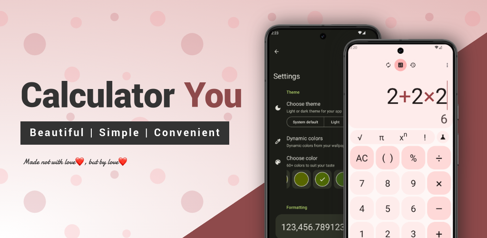

***This version readme is for my dissertation***

# Мобільний застосунок "Caculator You"

Кваліфікаційна робота на підтвердження ступеня фахового молодшого бакалавра ([ВСП «ППФК НТУ «ХПІ»](http://polytechnic.poltava.ua)).

Керівник роботи – **Бабич Олександр Вікторович**.

## Завдання до дипломної роботи

Розроблений програмний продукт має являти собою мобільний застосунок - калькулятор зі зручною системою навігації, темами оформлення, конвертором одиниць вимірювання та валют, історією обчислень, віконним режимом, розширеними налаштуваннями. Готовий застосунок має бути доступним для завантаження в Google Play.

## Використані технології

* Kotlin
* Java
* Android SDK
* Android Views
* Room
* Retrofit
* AndroidX Preference
* SQLite
* Android Material

## Опублікований продукт

