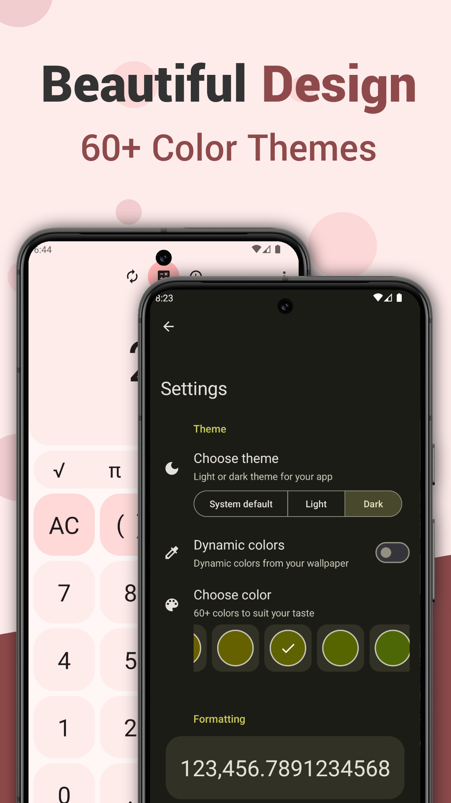
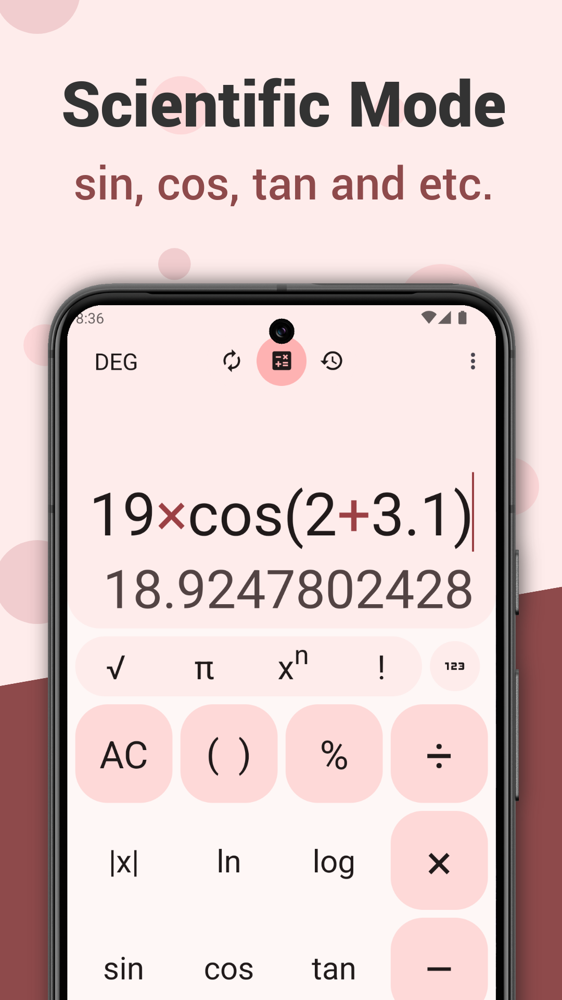
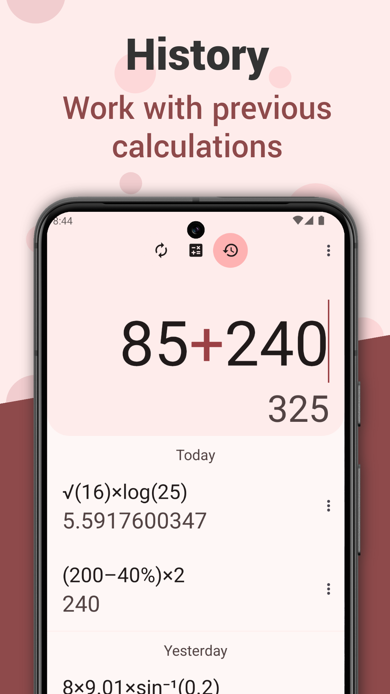
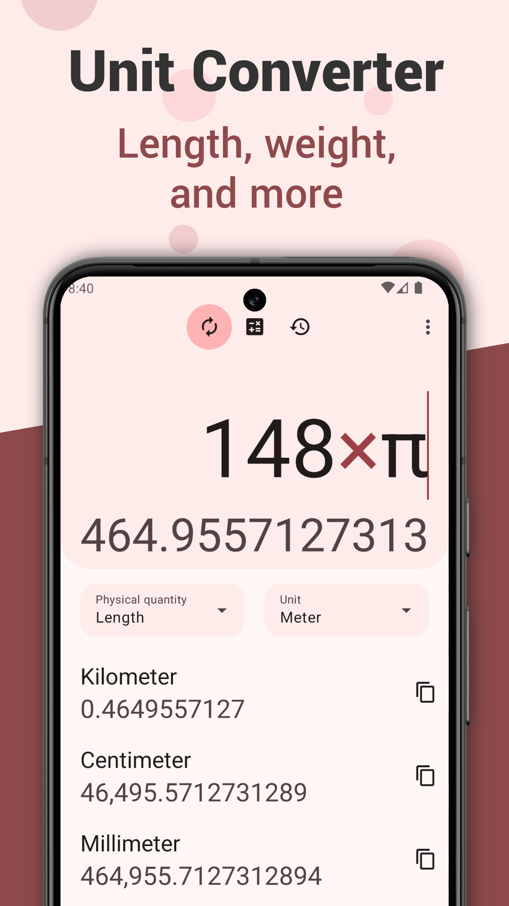

# Calculator You

### Calculator You is a beautiful calculator for solving simple tasks.

## ⬇️ Download ⬇️

## What does Calculator You include?

🎨 Beautiful Design & 60+ Color Themes: Personalize your calculator with a choice of 60+ vibrant color themes, making every calculation visually enjoyable.

🔬 Scientific Mode: Access advanced mathematical functions with our comprehensive scientific calculator, perfect for students, engineers, and math enthusiasts.

🕒 History: Easily track and review previous calculations with our handy history feature, ensuring you never lose important work.

📏 Unit Converter: Convert units effortlessly with our built-in converter, supporting a wide range of measurements, including length, weight, and more.

👌 User-Friendly Interface: Enjoy a clean, intuitive interface designed for effortless navigation and efficient calculations.

## :heart: Support Me

### ***Thank you very much for your help*** :heart:

Write a review about the app on [Google Play](https://play.google.com/store/apps/details?id=com.marktka.calculatorYou)

Help translate with [Hosted Weblate](https://hosted.weblate.org/engage/calculator-you/)

Support this app with a [PayPal](https://www.paypal.com/donate/?hosted_button_id=GKC26SLPUTQMU) donation 

## 📢 Join the telegram channel

Join the [telegram channel](https://t.me/devBlogCalculatorYou) to follow the project

## 🔢 Math Expressions Parser

### [Mihai Preda / arithmetic](https://github.com/preda/arithmetic)

## 🌐 Translation status

#### *Made not with love :heart:, but by love :heart:*
