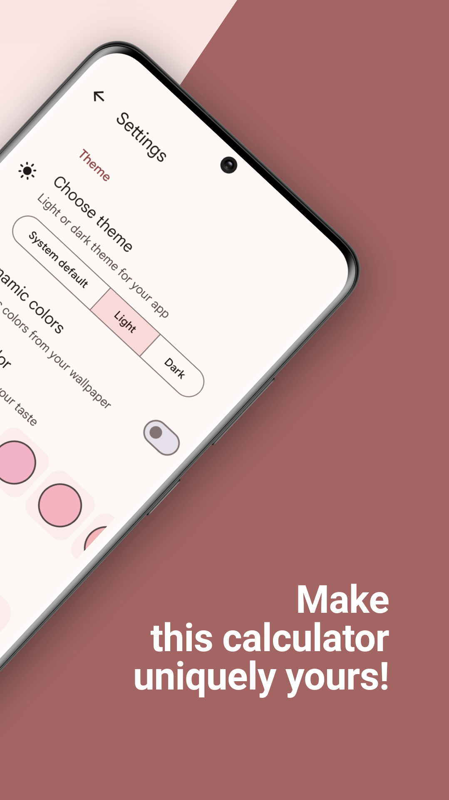
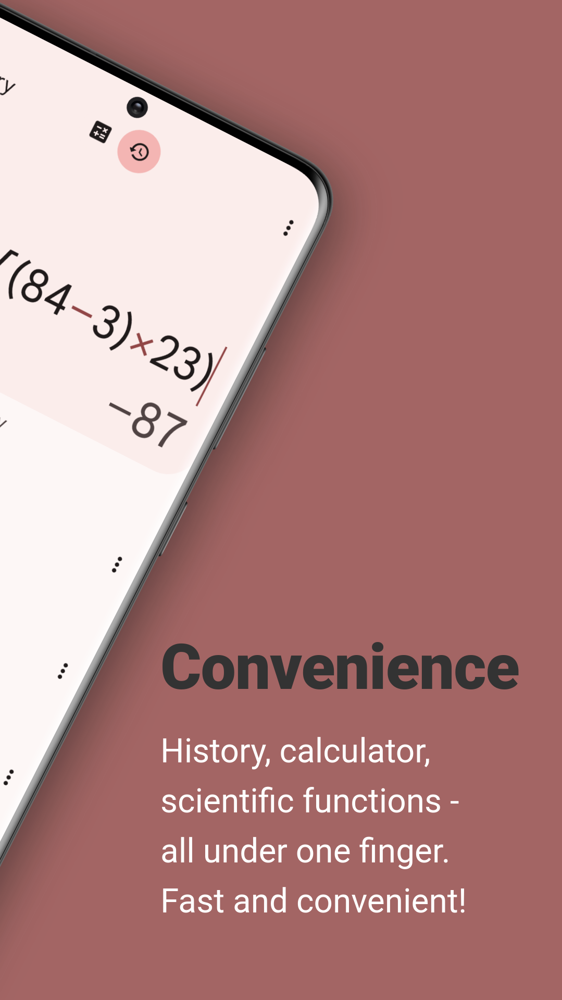

# Calculator You

### Calculator You is a beautiful calculator for solving simple tasks.

Coming soon to Play Store

## Description

#### Beautiful design:

The calculator has a beautiful and pleasant design that has been developed for a long time. The app utilizes Material 3 and dynamic colors based on your wallpaper. In addition to light and dark themes, the app also offers over 60 colorful themes to suit your taste. Make this calculator uniquely yours!

#### Scientific functions:

In addition to simple basic operators, there are also other functions. For example, cos, sin, tan, log, etc.

#### History:

The calculator has the ability to save your calculations. You can then work with them: resend for calculation, conveniently copy, share, and delete.

#### Convenience:

The app is designed so that all operations and actions can be performed with just one hand. History, calculator, scientific functions - all under one finger. Fast and convenient!

## Support

### Thank you very much for your help :heart:

Write a review about the app on [Google Play](https://play.google.com/store/apps/details?id=com.marktka.calculatorYou)

Help translate with [Hosted Weblate](https://hosted.weblate.org/engage/calculator-you/)

Support this app with a [PayPal](https://www.paypal.com/donate/?hosted_button_id=GKC26SLPUTQMU) donation 

## Math Expressions Parser

### [Darkempire78/OpenCalc](https://github.com/Darkempire78/OpenCalc)

## Translation status

### Made not with love :heart:, but by love :heart:

